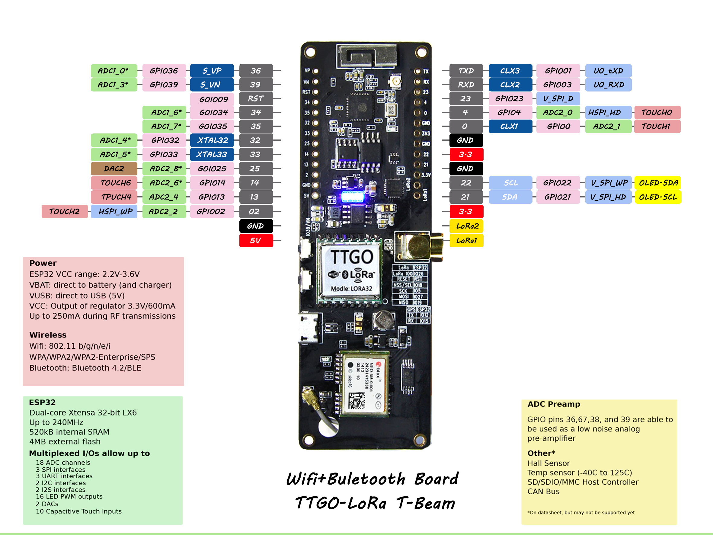
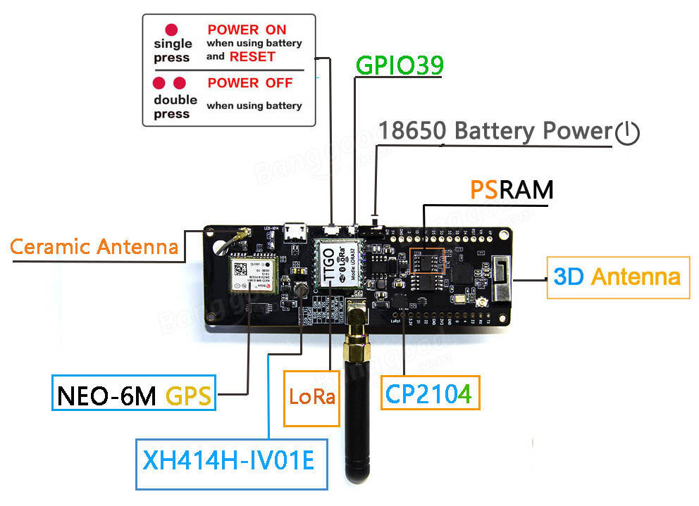

## BME280 Sensor Node for The Things Network

### For the TTGO T-Beam development platform

### Proof-of-concept for acquiring measurements from the BME280 sensor and transmitting humidity, temperature, and pressure to The Things Network

#### Based on the code from [xoseperez/ttgo-beam-tracker](https://github.com/xoseperez/ttgo-beam-tracker), with excerpts from [dermatthias/Lora-TTNMapper-T-Beam](https://github.com/dermatthias/Lora-TTNMapper-T-Beam) to fix an issue with incorrect GPS data. I also added support for the US 915 MHz frequency.

This is a LoRaWAN node based on the [TTGO T-Beam](https://github.com/LilyGO/TTGO-T-Beam) development platform using the SSD1306 I2C OLED display.
It uses a RFM95 by HopeRF and the MCCI LoRaWAN LMIC stack. This sample code is configured to connect to The Things Network using the US 915 MHz frequency by default, but can be changed to EU 868 MHz.

To start, install the dependencies, below. Then edit ```src/credentials.h``` to use either ```USE_ABP``` or ```USE_OTAA``` and the Keys/EUIs for your Application's Device from [The Things Network](https://www.thethingsnetwork.org/). Add the TTN Mapper integration to your Application (and optionally the Data Storage integration if you want to access the GPS location information yourself). Compile the code and upload it to your TTGO T-Beam. Turn on the device and once a GPS lock is acquired, the device will start sending data.

Arduino Library Dependencies:

 - [mcci-catena/arduino-lmic](https://github.com/mcci-catena/arduino-lmic)
 - [mikalhart/TinyGPSPlus](https://github.com/mikalhart/TinyGPSPlus)
 - [ThingPulse/esp8266-oled-ssd1306](https://github.com/ThingPulse/esp8266-oled-ssd1306)
 - [adafruit/Adafruit_BME280_Library](https://github.com/adafruit/Adafruit_BME280_Library)
 - [adafruit/Adafruit_Sensor](https://github.com/adafruit/Adafruit_Sensor)






